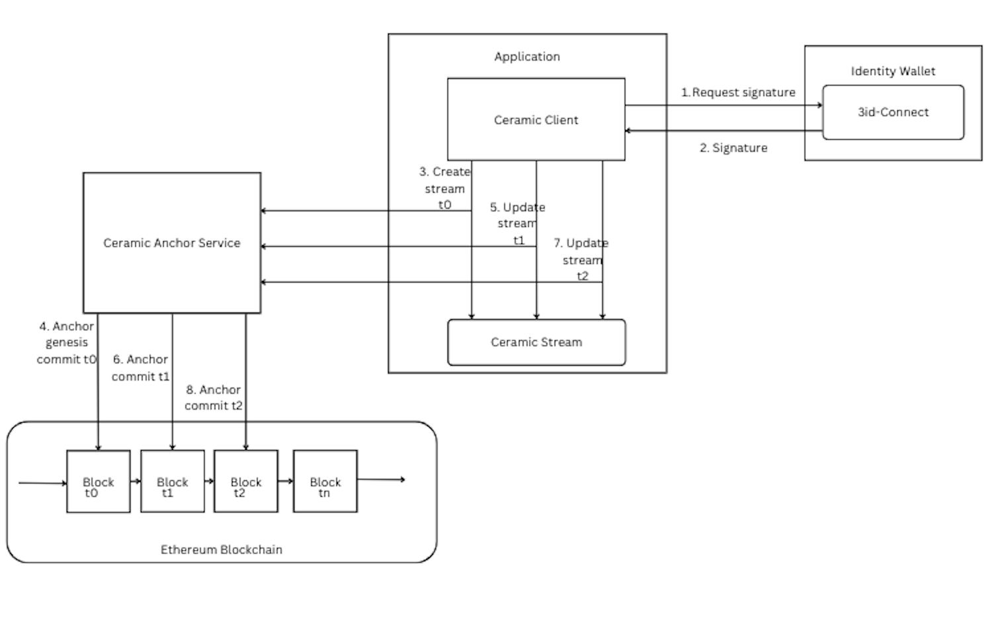

# Ceramic Anchor Service

## Background

Anchor commits are commits that contain a blockchain timestamp, providing an immutable record of time and ordering to other commits in the stream, sometimes known as a proof-of-publication. Anchor commits are needed since vanilla merkle DAGs have no notion of absolute time needed to build consensus.

A Ceramic Anchor Service (CAS) is a hosted "layer-2" solution for generating anchor commits for many different stream transactions in a scalable, low cost manner. Ceramic nodes are responsible for sending anchor requests containing a StreamID and a CommitID to a CAS, which then batches these transactions into a merkle tree, and includes the merkle root into a blockchain platform in a single transaction (currently Ethereum). After the transaction makes its way onto a blockchain, a Ceramic node creates an anchor commit which includes a reference to the blockchain transaction for every anchored stream. A CAS eliminates the need for each stream transaction to have its own corresponding blockchain transaction, which would be slower and more expensive.

## CAS Lifecycle

<figure markdown>
  { width="1800" }
  <figcaption>Ceramic Anchor Service sequence</figcaption>
</figure>

### 3ID Connect

### Genesis Commits on Stream Create

Upon initial Stream creation, a genesis create commit is executed written to the blockchain. Genesis commits may be signed by a public key, or unsigned.

### Anchor Commits on Stream Updates

When the application makes subsequent updates to the stream and contain a blockchain timestamp, providing an immutable record of time and ordering to other commits in the stream, sometimes known as a proof-of-publication.  A CommitID is returned to track the commits.

## CAS In Action

### Configuration

### Anchor Commits During Writes

### Finding Anchor Commits on Etherscan

