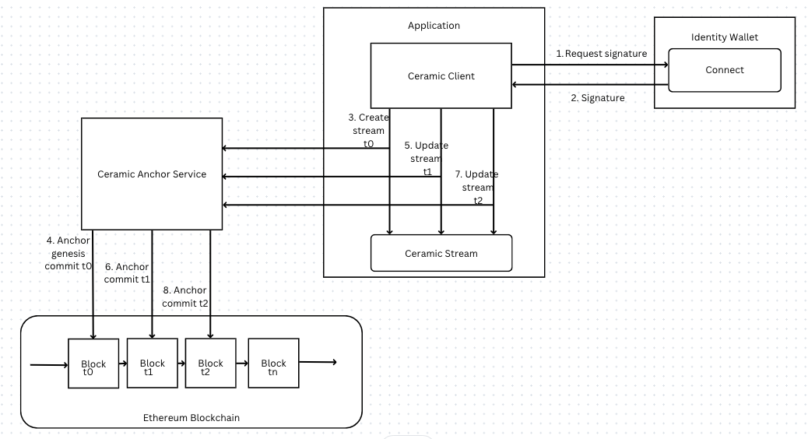

# Ceramic Anchor Service

## Background

### Ceramic Protocol

Ceramic is a decentralized protocol that enables the creation of mutable, tamper-resistant data structures on a worldwide public network. Ceramic's programmable data streams are achieved through a combination of digital signatures, stream update rules, and blockchain anchoring. A Ceramic stream can be used to build up flexible data structures that can in turn be used to represent a wide variety of things such as self-sovereign identities, specific pieces of data or content, media files, schemas, policies for data access control, verifiable credentials, agreements between multiple parties, etc.

### Anchor Commits

Anchor commits are commits that contain a blockchain timestamp, providing an immutable record of time and ordering to other commits in the stream, sometimes known as a proof-of-publication. Anchor commits are needed since vanilla merkle DAGs have no notion of absolute time needed to build consensus.

A Ceramic Anchor Service (CAS) is a hosted "layer-2" solution for generating anchor commits for many different stream transactions in a scalable, low cost manner. Ceramic nodes are responsible for sending anchor requests containing a StreamID and a CommitID to a CAS, which then batches these transactions into a merkle tree, and includes the merkle root into a blockchain platform in a single transaction (currently Ethereum). After the transaction makes its way onto a blockchain, a Ceramic node creates an anchor commit which includes a reference to the blockchain transaction for every anchored stream. A CAS eliminates the need for each stream transaction to have its own corresponding blockchain transaction, which would be slower and more expensive.

### Decentralized Identifiers (DIDs)

DIDs are globally unique identities used to sign documents on the Ceramic network and also interact with arbitrary off-chain services and data. More specifically, they are abstract, key-agnostic interfaces used to uniquely identify entities, interoperably sign and encrypt information, authorize authentication/access control to services, and store mappings to additional resources. Ceramic makes no assumptions about what kind of entity a DID represents, so they can be users, organizations, applications, services, devices, etc. DIDs can be controlled by one or many private keys, providing flexibility and interoperability across wallets and platforms.

A DID looks something like this ```did:key:z6Mknxv35RDpkX63N9Lzgzk4YRqSeN643L6cBq45XCpKaQvi```

## CAS Sequence

The figure below depicts the sequence of events within the CAS that are initiated by Ceramic client calls initiated from applications.

<figure markdown>
  { width="1800" }
  <figcaption>Ceramic Anchor Service sequence</figcaption>
</figure>

### Identity Authentication and Authorization

Authorization is accomplished via digital wallet to connect and authorize stream creation and update capabilities.  A DID is used to sign and commit genesis and update actions into blockchain transactions.

### Genesis Commits on Stream Create

Upon initial Stream creation, a genesis create commit is executed written to the blockchain. Genesis commits may be signed by a public key, or unsigned.  Genesis commit transactions can later be verified on the blockchain.

Show the Stream state

```zsh
% glaze stream:state kjzl6cwe1jw147vt5j5bllung1x1bvp1vgktw2t5tnkkfow6lygyr5ep4k1kltn
✔ Successfully queried stream kjzl6cwe1jw147vt5j5bllung1x1bvp1vgktw2t5tnkkfow6lygyr5ep4k1kltn
{
  type: 0,
  content: { title: 'A Document' },
  metadata: {
    unique: 'itz9WjhM21/WL1XZ',
    controllers: [ 'did:key:z6Mknxv35RDpkX63N9Lzgzk4YRqSeN643L6cBq45XCpKaQvi' ]
  },
  signature: 2,
  anchorStatus: 1,
  log: [
    {
      cid: CID(bagcqcerancxlb7eehmxax6qmmn7jt7aeszhx366tkh37iudquiv3be27tr5q),
      type: 0
      }
  ]
}
```
Note the ```did:key``` and ```cid``` values which correspond to the DID and commit identifier (CID).  The commit ID logs the anchor commit transaction from the underlying blockchain.

Note the ```anchorStatus: 1```

### Anchor Commits on Stream Updates

When the application makes subsequent updates to the stream, a blockchain transaction, its timestamp provide an immutable record of time and ordering to other commits in the stream, sometimes known as a proof-of-publication.  A CommitID is returned to track document commits.


## Configuration

Look at the configuration in ```~/.ceramic/daemon.config.json``` for Ceramic configuration including details about CAS and the network to connect for anchor commits.

```
"network": {
    "name": "testnet-clay"
  }
```

With this configuration, the anchor commits will be found on the ```testnet-clay``` which corresponds to the ```goerli`` testnet blockchain.
